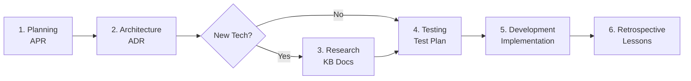

# Feature Development Workflow

**Visual Guide**: Phases, Handoffs, and Deliverables

---

## Workflow Phases



---

## Phase 1: Planning (APR)

**Agent**: `planner`

**Input**:

- User requirements
- Business goals

**Output**:

- `work-items/<branch>/plan/apr.md` - Complete APR document

**Key Sections**:

- Overview & Objective
- Goals & Success Metrics
- Feature Breakdown (with acceptance criteria)
- UX/Flow Notes (including WCAG 2.1 AA accessibility)
- System Requirements & Constraints
- Risks & Mitigations

**Exit Criteria**:

- APR approved by stakeholders
- Feature branch created (`git checkout -b feat/<name>`)
- Identified technical decisions requiring architecture

**Handoff**: → `architect` agent

---

## Phase 2: Architecture (ADR)

**Agent**: `architect`

**Input**:

- Approved APR
- Existing architecture docs (`knowledge-base/codebase/`)

**Output**:

- `work-items/<branch>/architecture/adr-*.md` - Architecture Decision Records
- `work-items/<branch>/architecture/contracts.md` - All interfaces and domain models
- `work-items/<branch>/architecture/diagrams.md` - ERD, component diagrams
- `work-items/<branch>/architecture/layers.md` - Layer architecture
- `work-items/<branch>/architecture/integration.md` - Integration points

**Key Decisions** (1 ADR each):

- Database choice (SQLite, PostgreSQL, MongoDB)
- ORM selection (Prisma, TypeORM, Sequelize)
- Design patterns (Repository, Factory, Strategy)
- Architectural layers (Domain, Infrastructure, Application, API)

**Contracts to Define**:

- Repository interfaces (IUserRepository, etc.)
- Domain models (User, Thought, Project, Action)
- DTOs (CreateUserDto, UpdateUserDto, etc.)
- Error contracts (EntityNotFoundError, etc.)

**Exit Criteria**:

- All major decisions have ADRs
- All interfaces defined with contract guarantees
- Data model diagrams created
- Layer architecture documented
- SOLID principles verified
- Integration points identified

**Handoffs**:

- → `researcher` (if new technologies identified)
- → `tester` (with contracts for test design)

---

## Phase 3: Research (Optional)

**Agent**: `researcher`

**Input**:

- List of new technologies from architecture phase
- Existing knowledge base

**Output**:

- `knowledge-base/<technology>/README.md` - Comprehensive docs (400+ lines)
- `work-items/<branch>/research/research-findings.md` - Research summary

**Technologies Requiring Research**:

- New frameworks (Prisma, Playwright, etc.)
- New patterns not documented
- New tools or libraries

**Exit Criteria**:

- Knowledge base updated for all new technologies
- Research findings documented
- Best practices captured

**Handoff**: → `tester` agent

---

## Phase 4: Testing (Test Strategy)

**Agent**: `tester`

**Input**:

- Approved APR (acceptance criteria)
- Architecture contracts (interfaces, domain models)
- Research findings (if applicable)

**Output**:

- `work-items/<branch>/tests/test-plan.md` - Complete test strategy
- Gherkin specifications for all features
- Unit test strategy (mock repositories)
- Integration test strategy (in-memory database)
- E2E test strategy (optional)

**Test Types**:

1. **Unit Tests** - Mock repositories, test services (70%+ coverage)
2. **Integration Tests** - In-memory SQLite, test Prisma implementations
3. **Contract Tests** - Verify implementations fulfill interface contracts
4. **E2E Tests** - Playwright for critical workflows (optional)

**Gherkin Format**:

```gherkin
Feature: User Registration
  Scenario: Create user with valid data
    Given I have a UserService with mocked repository
    When I call registerUser with email "test@example.com"
    Then a User should be returned with generated UUID
    And the repository create method should be called
```

**Exit Criteria**:

- All APR acceptance criteria have test scenarios
- Gherkin specifications written for all features
- Test coverage targets defined (70%+ minimum)
- Unit and integration test strategies documented
- Contract test approach defined

**Handoff**: → `developer` agent

---

## Phase 5: Development (Implementation)

**Agent**: `developer`

**Input**:

- Architecture ADRs (design decisions)
- Architecture contracts (interfaces to implement)
- Test plan (tests to satisfy)

**Output**:

- Implemented code following TDD:
  - Domain models (pure TypeScript)
  - Repository interfaces (domain layer)
  - Repository implementations (infrastructure layer)
  - Service layer (business logic)
  - API layer (HTTP routes)
- All tests passing (unit + integration)
- 70%+ test coverage achieved

**TDD Workflow**:

1. **Phase 1: Interfaces** (Day 1)
   - Define repository interfaces
   - Define domain models
   - Write unit tests with mocks (✅ PASS immediately)

2. **Phase 2: Implementation** (Day 2)
   - Create Prisma schema
   - Run migrations
   - Write integration tests (🔴 FAIL)
   - Implement Prisma repositories (🟢 PASS)

3. **Phase 3: Refactor** (Day 3)
   - Clean up code
   - Optimize queries
   - Remove dead code
   - Ensure all tests remain green

**Code Quality Checkpoints**:

- **Mid-implementation**: Check SRP and OCP, remove unused code
- **Pre-commit**: Full SOLID assessment, verify zero TypeScript errors
- **Continuous**: Run `npm run validate` (typecheck + lint + format)

**Exit Criteria**:

- All tests passing (unit + integration)
- 70%+ coverage achieved
- Zero TypeScript compilation errors
- All ADR requirements implemented
- Dead code removed
- SOLID principles verified

**Handoff**: → `retro` agent

---

## Phase 6: Retrospective (Lessons Learned)

**Agent**: `retro`

**Input**:

- Completed feature
- Development experience
- Test results
- Architecture decisions outcome

**Output**:

- `work-items/<branch>/retro/retrospective.md` - Complete retrospective

**Retrospective Framework (4Ls)**:

1. **Loved** - What went well?
2. **Loathed** - What was frustrating?
3. **Learned** - What insights did we gain?
4. **Longed for** - What do we wish we had?

**Key Questions**:

- Did architecture decisions work out?
- Were contracts stable during development?
- Did testers have enough info from architecture phase?
- Did tests catch bugs effectively?
- What would we do differently next time?

**Exit Criteria**:

- Retrospective document completed
- Concrete action items identified (KB updates, agent improvements, process changes)
- Follow-up tickets created
- Learnings shared with team

---

## Critical Insights

### Why Architecture Before Testing?

**Problem**: If testers don't have contracts, they write vague tests or wait for developers.

**Solution**: Architecture phase defines interfaces FIRST. Testers write tests against stable contracts.

**Example**:

```typescript
// Architecture defines contract:
interface IUserRepository {
  findById(id: string): Promise<User | null>; // Returns null if not found
}

// Tester writes scenario:
Scenario: Find user by ID (not found)
  When I call findById with "nonexistent"
  Then null should be returned
  And no exception should be thrown

// Developer implements to pass test:
async findById(id: string): Promise<User | null> {
  const user = await this.prisma.user.findUnique({ where: { id } });
  return user ? userToDomain(user) : null;
}
```

### Why ADRs Are Important?

**Without ADRs**:

- "Why did we choose Prisma?" - Nobody remembers 6 months later
- "Can we switch to TypeORM?" - Unclear what trade-offs were considered
- "Why Repository Pattern?" - Developers don't understand the design

**With ADRs**:

- ADR-001 explains Prisma choice with clear rationale
- Alternatives considered and rejected are documented
- Trade-offs are explicit (positive, negative, risks)
- Future developers understand WHY, not just WHAT

### Why Contracts Are Critical?

**Without Contracts**:

- Testers guess at behavior ("Does findById throw or return null?")
- Developers make inconsistent choices across repositories
- Integration points are unclear
- Mocking is difficult (don't know what to mock)

**With Contracts**:

- Behavior is explicit ("Returns null if not found, never throws")
- All implementations are consistent
- Testers write precise tests
- Mocking is trivial (interfaces define the surface)

---

## Workflow Variations

### Parallel Work

Some phases can overlap:

- **Research + Testing**: Researcher documents tech while tester writes tests
- **Testing + Development**: Developer can start on interfaces while tester finishes integration tests

**Critical Path**:

```
Planning → Architecture → Testing → Development
              ↓
          Research (parallel)
```

### Iterative Refinement

If architecture reveals APR issues:

- `architect` → `planner` handoff to clarify requirements
- Update APR, then resume architecture

If testing reveals architecture gaps:

- `tester` → `architect` handoff to add missing contracts
- Update contracts, then resume testing

---

## Agent Handoff Messages

### Planner → Architect

```
APR approved. Ready for architecture design.

**Key Requirements**:
- Database layer with Prisma + SQLite
- Repository Pattern for abstraction
- Domain models: User, Thought, Project, Action
- Layered architecture

**Technical Decisions Needed**:
- Database choice justification
- ORM selection rationale
- Layer architecture design
- Design patterns to apply

See: work-items/<branch>/plan/apr.md
```

### Architect → Researcher

```
Architecture design complete. New technologies identified:

**Technologies Requiring Research**:
- Prisma ORM 6.0+ (TypeScript ORM, migrations)
- SQLite 3.47+ (embedded database, WAL mode)

**Research Needed**:
- Best practices documentation (400+ lines each)
- Setup guides and examples
- Performance considerations
- Testing strategies

See: work-items/<branch>/architecture/ for ADRs
```

### Architect → Tester

```
Architecture design complete. Contracts defined for testing:

**Interfaces to Test**:
- IUserRepository (6 methods)
- IThoughtRepository (4 methods, immutable)
- IProjectRepository (8 methods, relations)
- IActionRepository (12 methods, relations)

**Domain Models**:
- User, Thought, Project, Action (with invariants)

**Contract Guarantees**:
- All behaviors explicitly defined
- Error handling specified
- Null vs throw decisions documented

**Target**: 70%+ coverage (unit + integration)

See: work-items/<branch>/architecture/contracts.md
```

### Tester → Developer

```
Test strategy complete. Ready for implementation.

**Test Suites**:
- 11 Gherkin features with scenarios
- Unit tests (mock repositories)
- Integration tests (in-memory SQLite)
- Contract tests (verify implementations)

**TDD Workflow**:
1. Define interfaces (tests pass with mocks)
2. Implement repositories (integration tests RED → GREEN)
3. Refactor and optimize

**Coverage Target**: 70%+ minimum

See: work-items/<branch>/tests/test-plan.md
```

### Developer → Retro

```
Feature implementation complete. Ready for retrospective.

**Completed**:
- All tests passing (unit + integration)
- 75% coverage achieved
- Zero TypeScript errors
- SOLID principles verified
- Dead code removed

**Architecture Outcomes**:
- Prisma + SQLite + WAL: Fast, zero-config ✅
- Repository Pattern: Clean testing, swappable implementations ✅
- Layered architecture: Clear separation of concerns ✅

**Challenges**:
- Mapper boilerplate (could generate?)
- In-memory SQLite setup took time
- Contract testing approach evolved during dev

See: work-items/<branch>/ for full artifacts
```

---

## Folder Structure Summary

```
work-items/<branch>/
├── plan/
│   └── apr.md                          # Phase 1: Planning
├── architecture/                       # Phase 2: Architecture
│   ├── adr-001-use-prisma-orm.md
│   ├── adr-002-use-sqlite-wal.md
│   ├── adr-003-repository-pattern.md
│   ├── contracts.md
│   ├── diagrams.md
│   ├── layers.md
│   └── integration.md
├── research/                           # Phase 3: Research (optional)
│   └── research-findings.md
├── tests/                              # Phase 4: Testing
│   └── test-plan.md
├── dev/                                # Phase 5: Development notes
│   └── implementation-notes.md
└── retro/                              # Phase 6: Retrospective
    └── retrospective.md
```

---

## Quick Reference

| Phase            | Agent      | Input           | Output           | Handoff             |
| ---------------- | ---------- | --------------- | ---------------- | ------------------- |
| 1. Planning      | planner    | User needs      | APR              | architect           |
| 2. Architecture  | architect  | APR             | ADRs + Contracts | researcher / tester |
| 3. Research      | researcher | Tech list       | KB docs          | tester              |
| 4. Testing       | tester     | Contracts + APR | Test plan        | developer           |
| 5. Development   | developer  | ADRs + Tests    | Code + Tests     | retro               |
| 6. Retrospective | retro      | Experience      | Lessons          | -                   |

---

**Remember**: Architecture is the bridge between business requirements (APR) and technical implementation (Development). Skipping architecture means testers lack contracts and developers lack design decisions.
